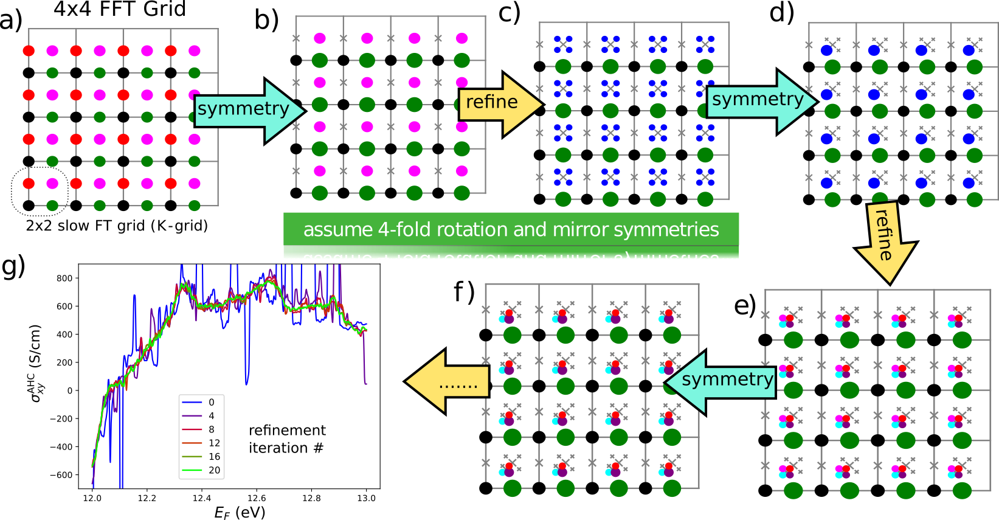

*********************
Methods 
*********************

Methods implemented in WannierBerri and allowing the performance boost are described in the following preprint article 

Stepan S. Tsirkin. "High performance Wannier interpolation of Berry curvature and related quantities with WannierBerri code", `npj Comput Mater 7, 33 (2021).  <https://www.nature.com/articles/s41524-021-00498-5>`_ (Open Access).

Below is given a section from that paper, just for reference.

.. _sec-wanfun:

General equations for Wannier interpolation
-------------------------------------------------------

The goal of this section is to introduce notation necessary for further
discussion. For more details please refer to review (`Marzari et al. 2012 <https://journals.aps.org/rmp/abstract/10.1103/RevModPhys.84.1419>`_) 
and original articles cited therein. The problem of Wannier
interpolation is stated in the following way. First we evaluate the
energies :math:`E_{n{\bf q}}` and wavefunctions
:math:`\psi_{n{\bf q}}({\bf r})\equiv e^{i{\bf q}\cdot{\bf r}}u_{n{\bf q}}({\bf r})`
from first principles on a rather coarse grid of
:math:`N_{\bf q}=N_{\bf q}^1\times N_{\bf q}^2\times N_{\bf q}^3`
wavevectors :math:`{\bf q}` within the reciprocal unit cell. Next we
want to find the energies and wavefunctions at points on a denser grid
of wavevectors :math:`{\bf k}`. Further we will consistently use
:math:`{\bf q}` and :math:`{\bf k}` to denote the *ab initio* and
interpolation grids respectively.

For a group of entangled bands one can define a set of :math:`J` WFs
defined as

.. math:: \vert{\bf R}n\rangle=\frac{1}{N_{\bf q}}\sum_{\bf q}e^{-i{\bf q}\cdot{\bf R}} \sum_{m=1}^{{\cal J}_{\bf q}} \vert\psi_{m{\bf q}}\rangle V_{mn}({\bf q}),

where :math:`{\cal J}_{\bf q}\ge J` and :math:`{\bf R}` are real-space
lattice vectors. The matrices :math:`V_{mn'}({\bf q})` contain all the
information of the construction of WFs, and may be generated by
Wannier90 code. They are constrained by
:math:`\sum_{m=1}^{{\cal J}_{\bf q}} V^*_{mn}({\bf q})V_{mn'}({\bf q})=\delta_{nn'}`
and are chosen in such a way that the WFs are localized, which yields
that the Bloch wavefunctions in the Wannier gauge

.. math::
   :label: eq-psiW

   \vert\psi_{n{\bf k}}^{\rm W}\rangle \equiv e^{i{\bf k}\cdot{\bf r}}\vert u_{n{\bf k}}^{\rm W}\rangle\equiv  \sum_{{\bf R}}e^{i{\bf k}\cdot{\bf R}}\vert{\bf R}n\rangle  \label{eq:psiW}

vary slowly with the :math:`{\bf k}` vector, unlike the true
wavefunctions. Now let us see how WFs may be used to interpolate the
band energies. First, one evaluates the matrix elements of the
Hamiltonian

.. math::
   :label: eq-fourier_q_to_R_H

   \begin{gathered}
       H_{mn}({\bf R})\equiv\frac{1}{N_{\bf q}}\sum_{\bf q}e^{-i{\bf q}\cdot{\bf R}} \langle\psi_{m{\bf q}}^{\rm W}\vert\hat{H}\vert\psi_{n{\bf q}}^{\rm W}\rangle=\\
       =\frac{1}{N_{\bf q}}\sum_{\bf q}e^{-i{\bf q}\cdot{\bf R}}\sum_{l}V^*_{lm}({\bf q})E_{l{\bf q}}V_{ln}({\bf q}).
       \label{eq:fourier_q_to_R_H}\end{gathered}

Next, to obtain energies at an arbitrary point :math:`{\bf k}` one needs
to construct the Wannier Hamiltonian

.. math::
   :label: eq-Hwann

   H_{mn}^{\rm W}({\bf k})=\sum_{\bf R}H_{mn}({\bf R})e^{i{\bf k}\cdot{\bf R}}, \label{eq:Hwann}

which further may be diagonalized as

.. math:: \sum_{mn} U_{ml}^*({\bf k}) H_{mn}^{\rm W}({\bf k})U_{nl'}({\bf k})=E_l({\bf k}) \delta_{ll'},

where :math:`U_{nl'}({\bf k})` are unitary matrices with columns
corresponding to the eigenvectors of the Hamiltonian
:eq:`eq-Hwann`. In a similar way, for any operator
:math:`\hat{X}`, for which the matrix elements are evaluated on the *ab
initio* grid, one may obtain the real-space matrix elements

.. math::
   :label: eq-fourier_q_to_R

   X_{mn}({\bf R})\equiv\frac{1}{N_{\bf q}}\sum_{\bf q}e^{-i{\bf q}\cdot{\bf R}} X_{mn}^{\text{W}}({\bf q}), \label{eq:fourier_q_to_R}

where in a simple case (e.g. :math:`\hat{X}=\boldsymbol{\sigma}`)

.. math::
   :label: eq-H_to_W

   X_{mn}^{\text{W}}({\bf q})= \sum_{ll'}V_{lm}^*({\bf q}) \langle\psi_{m{\bf q}}\vert\hat{X}\vert\psi_{n{\bf q}}\rangle V_{l'n}({\bf q}), \label{eq:H_to_W}

or if :math:`\hat{X}` involves momentum-space derivatives, (e.g. the
position operator
:math:`\hat{r}_\alpha\equiv i\partial/\partial k\alpha`) may also
involve matrix elements between neighbouring :math:`{\bf q}` points (see
`Wang et al. 2006 <https://journals.aps.org/prb/abstract/10.1103/PhysRevB.74.195118>`_, 
`Lopez et al. 2012 <https://doi.org/10.1103/PhysRevB.85.014435.>`_ for details). Then the matrix
elements may be interpolated to any :math:`{\bf k}` point in the Wannier
gauge by

.. math::
   :label: eq-fourier_R_to_k

   X_{mn}^{\rm W}({\bf k})=\sum_{\bf R}X_{mn}({\bf R})e^{i{\bf k}\cdot{\bf R}} , \label{eq:fourier_R_to_k}

and further rotated to the Hamiltonian gauge

.. math::
   :label: eq-rotate_gauge

   \overline{X}_{mn}^{\rm H}({\bf k})=\left( U^\dagger\cdot X^{\rm W}\cdot U \right)_{mn} . \label{eq:rotate_gauge}

Note that equations :eq:`eq-fourier_q_to_R_H`,
:eq:`eq-Hwann` are particular cases of
:eq:`eq-fourier_q_to_R` and
:eq:`eq-fourier_R_to_k`. Equation
:eq:`eq-fourier_q_to_R` can be performed by means
of FFT, and its result is periodic in :math:`{\bf R}` with a supercell
formed by vectors :math:`\mathbf{A}_i=\mathbf{a}_iN_{\bf q}^i`, where
:math:`\mathbf{a}_i` (:math:`i=1,2,3`) are the primitive unit cell
vectors. Among the equivalent :math:`{\bf R}` vectors we choose those
belonging to the corresponding Wigner-Seitz (WS) supercell. If an
:math:`{\bf R}` vector belongs to the WS supercell boundary, we include
all equivalent vectors on the boundary with the corresponding elements
:math:`X({\bf R})` divided by the degeneracy of the :math:`{\bf R}`
vector. Further, the MDRS method (see :ref:`sec-replica`) may also slightly modify the set
of :math:`{\bf R}` vectors.

As an example, the total Berry curvature of the occupied manifold is
interpolated (`Wang et al. 2006 <https://journals.aps.org/prb/abstract/10.1103/PhysRevB.74.195118>`_) via

.. math::
   :label: eq-Berry-wanint

   \begin{gathered}
   \Omega_\gamma ({\bf k}) =   {\rm Re\,}\sum_n^{\text{occ}}\overline{\Omega}^{\rm H}_{nn,\gamma}
   -2\epsilon_{\alpha\beta\gamma}{\rm Re\,}\sum_n^{\text{occ}}\sum_l^{\text{unocc}}D_{nl,\alpha}\overline{A}^{\rm H}_{ln,\beta}  \\
    +\epsilon_{\alpha\beta\gamma}{\rm Im\,}\sum_n^{\text{occ}}\sum_l^{\text{unocc}}D_{nl,\alpha} D_{ln,\beta} ,
   \label{eq:Berry-wanint}\end{gathered}

where the ingredients of the equation are obtained using
eqs. :eq:`eq-fourier_R_to_k`,
:eq:`eq-rotate_gauge` starting from
:math:`D_{nl,\alpha}\equiv\frac{\overline{H}_{nl,\alpha}^{\rm H}}{E_l-E_n}`,
:math:`H_\alpha^{\rm W}\equiv\partial_\alpha H^{\rm W}`,
:math:`A_{mn,\alpha}({\bf R})\equiv\langle\mathbf{0}m\vert\hat{r}_\alpha\vert{\bf R}n\rangle`,
:math:`\overline{\Omega}_\gamma^{\rm W} \equiv\epsilon_{\alpha\beta\gamma}\partial_\alpha A^{\rm W}_\beta`,
:math:`\partial_\alpha\equiv \partial/\partial{k_\alpha}`. The anomalous
Hall conductivity is evaluated as an integral

.. math::
   :label: eq-AHC

   \sigma_{\alpha\beta}^{\rm AHE}=-\frac{e^2}{\hbar}\epsilon_{\alpha\beta\gamma}\int \frac{d{\bf k}}{(2\pi)^3}\Omega_\gamma({\bf k}).
       \label{eq:AHC}

Note, that while the direct Fourier transform
(:eq:`eq-fourier_q_to_R`) is performed only once
for the calculation, and is not repeated for the multiple
:math:`{\bf k}` points upon interpolation, the inverse Fourier transform
(:eq:`eq-fourier_R_to_k`) is repeated for every
interpolation :math:`{\bf k}` point. And in fact it presents the most
time-consuming part of the calculation involving Wannier interpolation
as implemented in the Wannier90 code.

.. _sec-FFT:

Mixed Fourier transform 
--------------------------------

.. _figrefinement:

   (a-f) Illustration of the procedure of mixed Fourier transform, adaptive refinement and use of symmetries. 
   2D picture is used for visualization purposes, while the code actually works in 3D.  
   The area of colored circles corresponds to the weight of the :math:`\mathbf{K}`-point, 
   gray crosses denote the points with zero weight. See the text for detailed description. 
   (g) AHC of bcc Fe, evaluated from a grid of :math:`52\times 52\times 52` :math:`\mathbf{k}` points and 20 recursive adaptive refinement iterations.

In this section we will see how the evaluation of
(:eq:`eq-fourier_R_to_k`) may be accelerated. It is
easy to see that the computation time of a straightforward discrete
Fourier transform scales with the number of :math:`{\bf R}` vectors and
:math:`{\bf k}` points as :math:`t\propto N_{\bf R}N_{\bf k}`, and we
are typically interested in a case :math:`N_{\bf k}\gg N_{\bf R}`
(:math:`N_{\bf R}\approx N_{\bf q}`).

When the Fourier transform is done on a regular grid of :math:`{\bf k}`
points, it is usually appealing to use the FFT. For that one needs to
place the :math:`{\bf R}` vectors on a regular grid of size
:math:`N_{\bf k}`, fill the missing spots with zeros and perform the
standard FFT, which will scale as
:math:`t\propto N_{\bf k}\log{N_{\bf k}}`. However there are some
dificulties with such FFT. Mainly, because to perform FFT on a large
grid implies storing the data for all :math:`{\bf k}` points in memory
at the same time, which becomes a severe computational limitation. Also
FFT does not allow to reduce computation to only the
symmetry-irreducible :math:`{\bf k}` points, and is more difficult to do
in parallel. However there is a way to combine the advantages of both
the FFT and the usual discrete Fourier transform, leading to the concept
of *mixed Fourier transform*.

We want to evaluate (:eq:`eq-fourier_R_to_k`) for a
set of :math:`{\bf k}` points.

.. math::
   :label: eq-kgrid

   {\bf k}_{n_1,n_2,n_3}=\frac{n_1}{N_{\bf k}^1}{\bf b}_1 +\frac{n_2}{N_{\bf k}^2}{\bf b}_2 +\frac{n_3}{N_{\bf k}^3}{\bf b}_3 ,   \label{eq:kgrid}

where :math:`0\le n_i< N_{\bf k}^i` – integers (:math:`i=1,2,3`),
:math:`N_{\bf k}^i` – size of interpolation grid, :math:`{\bf b}_i` —
reciprocal lattice vectors. Now suppose we can factorize
:math:`N_{\bf k}^i=N_{\rm FFT}^i N_{\bf K}^i`\  [2]_ . Then the set of
points (:eq:`eq-kgrid`) is equivalent to a set of points
:math:`{\bf k}={\bf K}+\boldsymbol{\kappa}`, where

.. math::
   :label: eq-Kgrid

   \begin{aligned}
   {\bf K}_{l_1,l_2,l_3}&=&\frac{l_1}{N_{\bf k}^1}{\bf b}_1 +\frac{l_2}{N_{\bf k}^2}{\bf b}_2 +\frac{l_3}{N_{\bf k}^3}{\bf b}_3,  \label{eq:Kgrid}  \\
   \boldsymbol{\kappa}_{m_1,m_2,m_3}&=&\frac{m_1}{N_{\rm FFT}^1}{\bf b}_1 +\frac{m_2}{N_{\rm FFT}^2}{\bf b}_2 +\frac{m_3}{N_{\rm FFT}^3}{\bf b}_3,    \end{aligned}

where :math:`0\le l_i< N_{\bf K}^i`,
:math:`N_{\bf K}=\prod_i N_{\bf K}^i`, :math:`0\le m_i< N_{\rm FFT}^i`.
This separation is illustrated in
:numref:`figrefinement` (a), which shows a
2\ :math:`\times`\ 2 :math:`{\bf K}`-grid, each corresponding to
4\ :math:`\times`\ 4 FFT grid (dots of a certain color). Now for each
:math:`{\bf K}`-point we can define

.. math::
   :label: eq-XKR

   X_{mn}({\bf K},{\bf R})\equiv X_{mn}({\bf R})e^{i{\bf K}\cdot{\bf R}} \label{eq:XKR}

and then :eq:`eq-fourier_R_to_k` reads as

.. math::
   :label: eq-XKk

   X_{mn}^{\rm W}({\bf k}={\bf K}+\boldsymbol{\kappa}) = \sum_{\bf R}X_{mn}({\bf K},{\bf R})e^{i\boldsymbol{\kappa}\cdot{\bf R}} \label{eq:XKk}

The principle idea of mixed Fourier transform consists in performing the
Fourier transform :eq:`eq-XKk` as FFT, while
:eq:`eq-XKR` is performed directly. To perform the FFT we put
all the :math:`{\bf R}` vectors on a grid
:math:`N_{\rm FFT}^1\times N_{\rm FFT}^2\times N_{\rm FFT}^3`, and a
vector :math:`{\bf R}=\sum_{i=1}^3 n_i\mathbf{a}_i` is placed on a slot
with coordinates :math:`\widetilde{n}_i= n_i\,{\rm mod}\,N_{\rm FFT}^i`
(:math:`n_i` are both positive and negative integers, while
:math:`0\le \widetilde{n}_i<N_{\rm FFT}^i`). It is important to choose
the FFT grid big enough, so that two different :math:`{\bf R}` vectors
are not placed on the same slot in the grid.

The advantages of this approach are the following. First, the
computational time scales as :math:`t_1\propto N_{\bf K}N_{\bf R}` for
:eq:`eq-XKR` and
:math:`t_2\propto N_{\bf K}N_{\rm FFT}\log N_{\rm FFT}` for
:eq:`eq-XKk`. Because it is required that
:math:`N_{\rm FFT}\ge N_{\bf R}` (to fit all :math:`{\bf R}`-vectors in
the FFT box), we have
:math:`t_1 \le t_2 \propto N_{\bf k}\log N_{\rm FFT}` (in practice it
occurs that :math:`t_1 \ll t_2`), which scales better then both the Fast
and ’slow’ Fourier transforms. Next, we can perform
Eqs. :eq:`eq-XKR` and :eq:`eq-XKk` independently for
different :math:`{\bf K}`-points. This saves us memory, and also offers
a simple parallelization scheme. Also we can further restrict evaluation
only to symmetry irreducible :math:`{\bf K}`-points
(:ref:`sec-symmetry`) and also perform adaptive
refinement over :math:`{\bf K}`-points
(:ref:`sec-refine`).

Moreover, the evaluation time of a mixed Fourier transform only
logarithmically depends on the size of the *ab initio* grid (recall that
:math:`N_{\rm FFT}\sim N_{\bf R}\sim N_{\bf q}`), while for the slow
Fourier transform, the dependence is linear. However, in practice we
see  that the Fourier transform in
the present implementation consumes only a small portion of
computational time, and therefore the overall computational time is
practically independent of the size of the *ab initio* grid.

.. _sec-symmetry:

Symmetries 
-------------------------

When we integrate some quantity over the BZ, at every
:math:`{\bf K}`-point (after summing over :math:`\boldsymbol{\kappa}`
points) we obtain the result as a rank-:math:`m` tensor
:math:`X_{i_1,\ldots,i_m}({\bf K})`, for example the berry curvature
vector :math:`\Omega_\gamma` or the conductivity tensor
:math:`\sigma_{xy}`. Then the BZ integral is expressed as a sum

.. math::
   :label: eq-sumK

   {\cal X}=\sum_{\bf K}^{\rm all}  X({\bf K})w_{\bf K}\label{eq:sumK}

and we initially set :math:`\{{\bf K}\}` as a regular grid
:eq:`eq-Kgrid` and :math:`w_{\bf K}=1/N_{\bf K}`. Suppose
:math:`G` is the magnetic point group of the system. [3]_ We define the
set of symmetry-irreducible :math:`{\bf K}` points :math:`\rm irr` as a
a set of points that :math:`\forall {\bf K},{\bf K}'\in{\rm irr}`,
:math:`\forall g\in G` holds :math:`g{\bf K}\neq{\bf K}'`, unless
:math:`g=E` (identity). Then we can rewrite the sum
:eq:`eq-sumK` as

.. math::
   :label: eq-sumK-split

   {\cal X}=\sum_{\bf K}^{\rm all}  g_{\bf K}X(g_{\bf K}^{-1}{\bf K})w_{\bf K}
         \label{eq:sumK-split}

where we choose :math:`g_{\bf K}` such that
:math:`g_{\bf K}^{-1}{\bf K}\in{\rm irr}` (this choice may be not
unique), and obviously :math:`g_{\bf K}=E` for
:math:`{\bf K}\in{\rm irr}`. Thus, only the irreducible :math:`{\bf K}`
points need to be evaluated. Next, to make sure that the result respects
the symmetries, despite possible numerical inaccuracies, we symmetrize
the result as:

.. math::
   :label: eq-symmetrize

   {\cal\widetilde X} = \frac{1}{|G|}\sum_f^{G} f {\cal X}.   \label{eq:symmetrize}

Note, that :math:`{\cal\widetilde X}={\cal X}` if the model respects the
symmetry precisely (e.g. when symmetry-adapted WFs (Sakuma 2013) are
used). Combining :eq:`eq-sumK-split` and
:eq:`eq-symmetrize` and using
:math:`\sum_f^{G} f\cdot g_{\bf K}= \sum_f^{G} f` we get

.. math::
   :label: eq-symmetrize-final

   {\cal\widetilde X}= \frac{1}{|G|}\sum_f^{G} f \left[\sum_{\bf K}^{\rm irr}  X({\bf K}) \left( \sum_{{\bf K}'}^{G\cdot{\bf K}} w_{{\bf K}'} \right) \right] , \label{eq:symmetrize-final}

where :math:`G\cdot{\bf K}` denotes the orbit of :math:`{\bf K}` under
action of group :math:`G`. The latter equation reflects the
implementation in the ``WB`` code. Starting from a regular grid of
:math:`{\bf K}` points we search for pairs of symmetry-equivalent
points. Whenever such a pair is found, one of the points is excluded and
it’s weight is transferred to the other point. Compare
:numref:`figrefinement` (a) and (b): the red
points are removed and their weight is moved to green points. Thus we
end with a set of irreducible :math:`{\bf K}`-point with weights
:math:`\widetilde{w}_{\bf K}=\sum_{{\bf K}'}^{G\cdot{\bf K}} w_{{\bf K}'}`.
Next we evaluate :math:`X({\bf K})` (employing the corresponding
interpolation scheme) only at symmetry-irreducible
:math:`{\bf K}`-points. Note, that although some :math:`{\bf k}`-points
corresponding to the same :math:`{\bf K}`-point (same color in
:numref:`figrefinement` are equivalent, we have to
evaluate them all to be able to use the FFT. Finally, after summation,
we symmetrize the result. The described procedure achieves two goals:
(i) reduce the computational costs and (ii) make the result precisely
symmetric, even if the WFs are not perfectly symmetric. In the present
example we managed to obtain highly symmetric WFs (although without
employment of symmetry-adapted WFs method), and therefore the
symmetrization procedure does not change the result (within relative
accuracy :math:`\sim 10^{-5}`). However, for complex materials such
quality of WFs is not always easy to achieve.

.. _sec-refine:

Recursive adaptive refinement  
-------------------------------

It is well known that in calculations of quantities involving Berry
curvature or orbital moments, one performs integration over
:math:`{\bf k}`-space of a function that rapidly changes with
:math:`{\bf k}`. As a result, small areas of :math:`{\bf k}`-space give
the major contribution to the integral. Such areas often appear in the
vicinity of Weyl points, nodal lines, as well as avoided crossings. To
accelerate convergence with respect to the number of :math:`{\bf k}`
points, we utilize adaptive mesh refinement similar to Refs. (
`Yao et al. 2004 <https://doi.org/10.1103/PhysRevLett.92.037204.>`_; 
`Wang et al. 2006 <https://journals.aps.org/prb/abstract/10.1103/PhysRevB.74.195118>`_). The authors of (Yao et al. 2004; Wang et al.
2006) assumed a pre-defined threshold, and the :math:`{\bf k}`-points
yielding Berry curvature above the threshold were refined. This is
inconvenient because one needs a good intuition to guess an optimal
value for this threshold, because it depends both on the quantity one
wants to calculate, and the material considered.

In ``WB`` it is implemented in a way that does not require initial guess
from the user. This procedure, in combination with symmetrization
described above, is illustrated in
:numref:`figrefinement` in two dimensions (2D),
while the actual work in 3D is described below. After excluding
symmetry-equivalent :math:`{\bf K}`-points
(:numref:`figrefinement` (b)) the results are
evaluated for every :math:`{\bf K}` point and stored. We assume that
initially each :math:`{\bf K}` point has weight
:math:`\widetilde{w}_{\bf K}` and corresponds to a volume defined by
vectors :math:`\mathbf{c}_{\bf K}^i=\mathbf{b}_i/N_{\bf k}^i` centered
at :math:`{\bf K}`. Then we pick a few "most important
:math:`{\bf K}`-points". The criteria of importance may be different -
either the Maximal value for any :math:`E_F`, or maximal value summed
over all :math:`E_F`, or yielding most variation over the :math:`E_F`
(if the evaluated quantity is a function of Fermi level :math:`E_F`).
Suppose we selected the magenta point. Then those points are refined —
replaced with 8 points around it with coordinates

.. math:: {\bf K}'={\bf K}\pm\frac{\mathbf{c}_{\bf K}^1}{4}\pm\frac{\mathbf{c}_{\bf K}^2}{4}\pm\frac{\mathbf{c}_{\bf K}^3}{4},

where all combinationgs of :math:`\pm` signs are used. In
:numref:`figrefinement` (c) 4 new blue
:math:`{\bf K}`-points in the 2D case. The weight and volume of the
initial point is distributed over the new points, thus
:math:`w_{{\bf K}'}=\widetilde{w}_{\bf K}/8` and
:math:`\mathbf{c}_{{\bf K}'}^i=\mathbf{c}_{{\bf K}}^i/2`. Then the
symmetrization is applied again (the four blue points are connected by
4-fold rotation) to exclude the equivalent points, and the weight of the
equivalent points is collected on the remaining point, while the vectors
:math:`\mathbf{c}_{{\bf K}'}^i` are not changed. After the new
:math:`{\bf K}`-points are evaluated, we go to the next iteration of
refinement. On each iteration any point may be refined, including both
those from the initial regular grid, and those created during previous
refinement iterations. The procedure stops after the pre-defined number
of iterations was performed.
:numref:`figrefinement` (g) shows how undesired
artificial peaks of the the AHC curve are removed iteration by
iteration, yielding a smooth curve.

.. _sec-replica:

Minimal-distance replica selection method
-------------------------------------------

The MDRS method (`Pizzi et al. 2020 <https://doi.org/10.1088/1361-648x/ab51ff.>`_) allows to obtain a more accurate
Wannier interpolation, in particular when moderate :math:`{\bf q}`-grids
are used in the *ab initio* calculations. With MDRS method the Fourier
transform :eq:`eq-fourier_R_to_k` is modified in
the following way:

.. math::
   :label: eq-replica

   X_{mn}^{\rm W}({\bf k})=\sum_{\bf R}\frac{1}{{\cal N}_{mn{\bf R}}} X_{mn}({\bf R})\sum_{j=1}^{{\cal N}_{mn{\bf R}}} e^{i{\bf k}\cdot\left({\bf R}+\mathbf{T}_{mn{\bf R}}^{(j)}\right)} ,\label{eq:replica}

where :math:`\mathbf{T}_{mn{\bf R}}^{(j)}` are
:math:`{\cal N}_{mn{\bf R}}` lattice vectors that minimise the distance
:math:`|{\bf r}_m-({\bf r}_n+{\bf R}+{\bf T})|` for a given set
:math:`m,n,{\bf R}`. However, the evaluation of
:eq:`eq-replica` is quite slower than
:eq:`eq-fourier_R_to_k`, because every
:math:`{\bf k},m,n,{\bf R}` an extra loop over :math:`j` is needed.
Therefore calculations employing MDRS in ``postw90.x`` (which is enabled
by default) takes more time. Instead it is convenient to re-define the
modified real-space matrix elements as

.. math::
   :label: eq-replica1

   \widetilde{X}_{mn}({\bf R}) = \sum_{{\bf R}'} \frac{1}{{\cal N}_{mn{\bf R}'}} X_{mn}({\bf R}') \sum_{j=1}^{{\cal N}_{mn{\bf R}'}}   \delta_{{\bf R},{\bf R}'+\mathbf{T}_{mn{\bf R}'}^{(j)}}\label{eq:replica1}

only once for the calculation, and then the transformation to
:math:`{\bf k}`-space is performed via

.. math::
   :label: eq-replica2

   X_{mn}^{\rm W}({\bf k})=\sum_{\bf R}e^{i{\bf k}{\bf R}} \widetilde{X}_{mn}({\bf R}). \label{eq:replica2}

Note, that the set of :math:`{\bf R}` vectors in
:eq:`eq-replica1` is increased compared to the initial
set of vectors in :eq:`eq-fourier_q_to_R` in order
to fit all nonzero elements :math:`\widetilde{X}_{mn}({\bf R})` Equation
:eq:`eq-replica2` having essentially same form as
:eq:`eq-fourier_R_to_k`, can be evaluated via mixed
Fourier transform, as described in :ref:`sec-FFT`.

Thus the MDRS method implemented in ``WB`` via
Eqs. :eq:`eq-replica1`-:eq:`eq-replica2`,
and has practically no extra computational cost, while giving notable
accuracy improvement.

.. [2]
   This is always possible unless :math:`N_{\bf k}^i` is a prime number.
   But for really dense grids, we can adjust :math:`N_{\bf k}^i` a bit,
   to be factorizable in any way we want.

.. [3]
   Because :math:`X({\bf K})` is invariant under translations, here we
   are interested in the point group, rather then space group.

