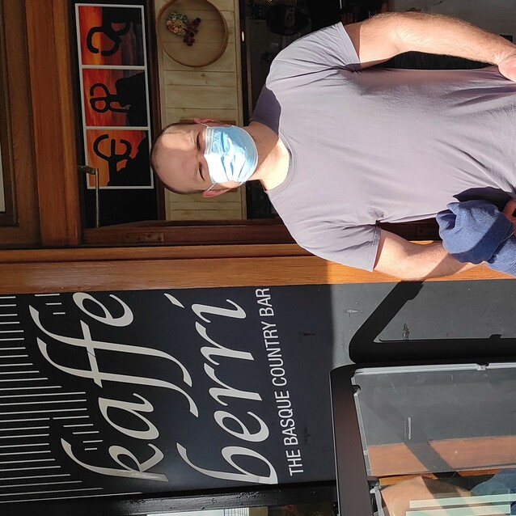
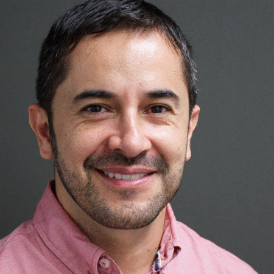

*******
People
*******

Author
==============

Stepan Tsirkin, University of Zurich

|

Contributed
==============

.. list-table:: 
   :align: left
   :widths: 33 33 33
   :header-rows: 0

   * - Xiaoxiong Liu

       University of Zurich

       Switzerland

       .. image:: imag/photo/Xiaoxiong_Liu.jpg
          :width: 200px
          :alt: Xiaoxiong Liu
          :target: https://www.physik.uzh.ch/en/groups/neupert/team/Xiaoxiong-Liu.html

     - Jae-Mo Lihm, 

       Seoul National University

       Republic of Korea

       .. image:: imag/photo/jaemo-lihm.jpeg
          :width: 200px
          :alt: Jae-Mo

     - Patrick Lenggenhager

       Paul Scherrer Institute
       
       Switzerland

       .. image:: imag/photo/patrick.jpg
          :width: 200px
          :alt: Patrick
          :target: https://www.psi.ch/en/lsm/people/patrick-mario-lenggenhager 

   * - Minsu Ghim,
      
       Seoul National University
       
       Republic of Korea

       .. image:: imag/photo/minsu.jpg
           :width: 200px
           :alt: Minsu Ghim

     - Miguel Ángel Jiménez Herrera

       University of the Basque Country

       San Seabstian, Spain
       
       .. image:: imag/photo/Miguel_Angel_Jimenez.jpg 
          :width: 200px
          :alt: Miguel Angel Jimenez Herrera
          :target: https://cfm.ehu.es/team/miguel-angel-jimenez-herrera/

     - Ji Hoon Ryoo, 
      
       Seoul National University
       
       Republic of Korea

       .. image:: imag/photo/jihoon.png
           :width: 200px
           :alt: Ji Hoon

   * - Julen Ibañez Azpiroz 

       Centro de Física de Materiales

       San Sebastián, Spain

       .. image:: https://cfm.ehu.es/view/files/julen_Iba%C3%B1ez.jpg
           :width: 200px
           :alt: Julen
           :target: https://cfm.ehu.es/team/julen-ibanez-azpiroz/

     - 

     - 

Working on 
============

.. list-table:: 
   :align: left
   :widths: 33 33 33
   :header-rows: 0

   *  - Iñigo Robredo Magro

        Donostia International Physics Center

        San Sebastián, Spain
       
        .. image:: https://pbs.twimg.com/profile_images/1166671811062501376/YBQfHmSm_400x400.jpg
           :width: 200px
           :alt: Inigo Robredo

      -

      -

Consultants
==============
.. list-table:: 
   :align: left
   :widths: 33 33 
   :header-rows: 0

   *  - Ivo Souza

        IKERBASQUE foundation

        .. image:: https://cfm.ehu.es/view/files/Perfil-Ivo-Souza_mini.jpg
           :width: 200px
           :alt: Ivo Souza
           :target: https://cfm.ehu.es/ivo/

      - Cheol-Hwan Park 

        Seoul National University

        .. image:: imag/photo/cheol-hwan.jpg
           :width: 200px
           :alt: Cheol Hwan Park
           :target: https://physics.snu.ac.kr/en/research-faculty/faculty/fulltime?mode=view&profidx=16

Active bug reporters:
======================

.. list-table:: 
   :align: left
   :widths: 25  25 25 
   :header-rows: 0

   * -  Rafael González, 
   
        Universidad del Norte, 
        
        Colombia 
        
        |rafael|

     -  Minkyu Park (박민규), 
     
        University of Ulsan, 
        
        Republic of Korea

     - Kisung Kang, 
     
       University of Illinois 
       
       at Urbana-Champaign, USA

    

