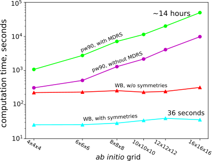
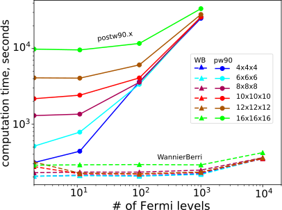

.. _sec-timing:

*************************************************************
Speed
*************************************************************

In this section we will compare the calculation time for the
calculations of anomalous Hall conductivity using Wannier90 and
``WannierBerri``. We will take the example of bcc Fe and vary different
parameters. Calculations were performed on identical 32-core virtual
nodes of the ScienceCloud cluster at University of Zurich. The nodes are
based on AMD EPYC 7702 64-Core Processors with frequency 2GHz and 128 GB
RAM per node, and one node was used per task.

The computation consists of two phases. First, some preliminary
operations are done. Those include reading the input files and
performing Fourier transform from ab initio grid :math:`{\bf q}` to
real-space vectors :math:`{\bf R}` :
eqs. `[eq:fourier_q_to_R_H] <#eq:fourier_q_to_R_H>`__ and
`[eq:fourier_q_to_R] <#eq:fourier_q_to_R>`__. This operation takes in
``WannierBerri``\ (postw90) between 2 (3) seconds for the small ab-initio grid
4x4x4 and 2 (3) minutes for a large grid of 16x16x16. This time is
mostly taken by reading the large formatted text file ``Fe.mmn``, and it
is done only once and does not scale with the density of the
interpolation grid. In ``WannierBerri``\ this is done in the constructor of
the ``System\_w90`` class, and the object can be saved on disk using a
``pickle`` module, so that this operation does not repeat for further
calculations.

Next comes the interpolation part itself, for which the evaluation time
scales linearly with the number of :math:`{\bf k}`-points used. Further
the time for an interpolation grid 200x200x200 is given, which is a
rather good grid to make an accurate calculation for this material.

   Computational time for AHC using ``WannierBerri``\ (triangles)
   and ``postw90.x``\ (circles) for different ab initio grids. For
   ``postw90.x``\ the calculations are done with (yellow) and without
   (purple) MDRS. Fpr ``WannierBerri``\ the calculations are done with (cyan)
   and without (red) use of symmetries.

We start with comparing time with the MDRS switched off
(``use_ws_distance=False``) and without use of symmetries in ``WannierBerri``.
As can be seen in :numref:`fig:timing`, for a small abinitio
:math:`{\bf q}`-grid 4x4x4 ``WannierBerri``\ is just slightly faster then
``postw90.x``. However, for dense :math:`{\bf q}`-grids the
computational time of ``postw90.x``\ grows linearly with the number of
:math:`{\bf q}` points, while in ``WannierBerri``\ it stays almost the same.
This happens because in ``postw90.x``\ the Fourier transform is major
time-consuming routine. On the other hand, in ``WannierBerri``, although cost
of the mixed Fourier transform is expected to grow logarithmically with
the ab-initio grid (see :ref:`sec-FFT`), we do not see it
because Fourier transform amounts only to :math:`\sim 10`\ % of the
computational time.

Next, we switch on the MDRS method (``use_ws_distance=True``) in
``postw90.x``, and the computational time grows by a factor of 5. On the
other hand the computational time does not change (not shown), just by
construction, as described in :ref:`sec-replica`.

Finally let’s switch on the use of symmetries in :math:`{ \tt WannierBerri }`.
Thus the computational time decreases by a factor of 8. In the
ultra-dense grid limit one would expect the speedup to be approximately
equal to the number of elements in the group — 16 in the present
example, due to exclusion of symmetry-equivalent :math:`{\bf K}`-points.
But this does not happen, because we use an FFT grid of 25x25x25
:math:`\boldsymbol{\kappa}`-points, hence the :math:`{\bf K}`-grid is
only :math:`8x8x8`, and a considerable part of :math:`{\bf K}`-points
are at high-symmetry positions. Therefore they do not have symmetric
partners to be excluded from the calculation.

   Computational time for scanning multiple chemical
   potentials using ``WannierBerri``\ and ``postw90.x``\ for different ab
   initio grids. MDRS method and symmetries are disabled here.

Thus we can see that the difference in computational time with
``postw90.x``\ and ``WannierBerri``\ reaches 3 orders of magnitude for this
example. Note that The examples above were performed only for the
pristene Fermi level. Now let’s see what happens upon scanning the
chemical potential (:numref:`fig:timing-fscan`). In ``WannierBerri``\ the
computational time remains practically unchanged when we use upto
:math:`N_\mu\approx1000` chemical potentials, and only start to grow
considerably at :math:`N_\mu\sim 10^4`. On the other hand in
``postw90.x``\ the computational time significantly grows with
:math:`N_\mu`, which is especially remarkable for small
:math:`{\bf q}`-grids.

In this section we did not use the adaptive refinement procedure.
However when on starts from a rather dense grid of
:math:`{\bf K}`-points, the new :math:`{\bf K}`-points coming from the
refinement procedure constitute only a small portion of the initial
grid, and hence do not contribute much into computational time.
